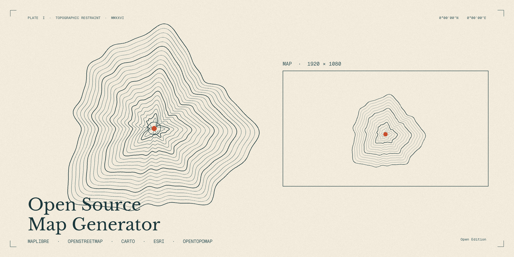

# Open Source - Map Generator

A Figma plugin to export high-resolution map sections from open-source basemaps
into editable Figma frames. Drop pins, draw routes (driving directions or
bezier arcs), and get back a layered Figma frame with the map, pins, and
routes as independently editable layers.



## Features

- **8 map styles** — Voyager / Light / Dark (each with or without labels),
  Satellite (Esri World Imagery), Terrain (OpenTopoMap)
- **Frame size presets** — Full HD, Vertical HD, Square, 4:3, HD, 2K, 4K, plus
  custom width × height
- **Pins** with editable labels, dropped from a side panel
- **Routes** between two locations: real driving directions (OpenRouteService)
  or a clean curved arc (bezier-bow)
- **Place search** with autocomplete (Nominatim) — also accepts raw `lat,lng`
- **View controls**: bearing / pitch / zoom number inputs with stepper buttons,
  reset
- **Layered Figma export** — Map / Routes / Pins as separate, editable layers.
  Pins are native ellipses + text. Routes are native vector polylines. Edit
  colour, weight, position after export.
- **1× / 2× / 3× export** at PNG or JPEG
- **Recent searches** persisted via Figma `clientStorage`

## Setup (for end users)

The Arc route style and all map styles work with **zero setup**.

To use **Roads** routing you need a free OpenRouteService API key:

1. Sign up free at [openrouteservice.org/dev/#/signup](https://openrouteservice.org/dev/#/signup)
   (no credit card).
2. In the dashboard, create a Standard token.
3. Paste it into the Routes tab → Routing API key field, click Save.

Free tier covers 2,000 routes per day per user. The key is stored only in
your local Figma `clientStorage`.

## Develop (for contributors)

```bash
git clone https://github.com/Delta365/open-source-map-generator.git
cd open-source-map-generator
npm install
npm run build      # builds dist/code.js + dist/ui.html
npm run watch      # watch mode for iterative development
npm run typecheck  # tsc --noEmit
```

Then in **Figma desktop**:

1. Plugins → Development → **Import plugin from manifest…**
2. Select `manifest.json` from this repo.
3. Plugins → Development → **Open Source - Map Generator**.

Re-running the plugin re-reads `dist/`, so during `npm run watch` you can
press **⌥⌘P** in Figma to re-run with your latest changes.

## Project structure

```
manifest.json          — Figma plugin manifest (network access, editor type, etc.)
package.json           — npm config + scripts
tsconfig.json          — TypeScript config (strict, ES2017 for code, ES2020 for ui)
build.mjs              — esbuild script (one-shot + watch)
src/
  code.ts              — Figma sandbox / main thread (creates frames, manages clientStorage)
  ui.html              — UI shell + CSS; placeholders for build-time inlined JS/CSS
  ui.ts                — UI logic (MapLibre, search, pins, routes, export)
  global.d.ts          — module declarations (CSS imports)
assets/
  icon.png             — 128 × 128 plugin icon
  cover.png            — 1920 × 960 Community cover art
  philosophy.md        — design philosophy that drove the assets
  render.py            — Pillow script that generates icon + cover (for re-rendering)
dist/                  — built artifacts (gitignored)
```

The build inlines the entire `ui.ts` bundle (including MapLibre GL) and its
CSS into `ui.html`, so the plugin ships as exactly two files: `dist/code.js`
and `dist/ui.html`.

## How layered export works

When you have any pins or routes, the export creates this Figma structure:

```
Map 1920×1080 — Voyager        ← outer frame
├── Map                        ← Rectangle, image fill (basemap raster)
├── Routes                     ← Frame (transparent)
│   ├── London → Paris         ← native Vector polyline
│   └── …
└── Pins                       ← Frame (transparent)
    ├── Pin 1                  ← native Ellipse
    ├── Pin 1                  ← native Text label
    └── …
```

Pins/routes are projected from `lng,lat` to screen pixels via
`map.project()` on an off-screen render of the basemap, so they land exactly
where they did in the preview. Behind-the-camera points (in 3D-pitched views)
are filtered out via a project → unproject round-trip check, with a status
message telling the user how many were skipped.

## Built on open source

| Project | Use | Licence |
|---|---|---|
| [MapLibre GL JS](https://maplibre.org) | Mapping engine | BSD-3-Clause |
| [CARTO basemaps](https://carto.com/basemaps) | Voyager / Light / Dark styles | CC BY 3.0 |
| [OpenStreetMap](https://www.openstreetmap.org/copyright) | Underlying map data | ODbL |
| [Esri World Imagery](https://www.arcgis.com/home/item.html?id=10df2279f9684e4a9f6a7f08febac2a9) | Satellite tiles | Esri terms (attribution required) |
| [OpenTopoMap](https://opentopomap.org) | Terrain tiles | CC BY-SA 3.0 |
| [Nominatim](https://nominatim.openstreetmap.org) | Place search | OSMF |
| [OpenRouteService](https://openrouteservice.org) | Driving directions | HeiGIT, OSM-based |

> **Heads up**: The OpenTopoMap (Terrain) style is CC BY-SA 3.0 — published
> work containing a Terrain export inherits the same licence and must credit
> both OpenTopoMap and OpenStreetMap contributors. The plugin shows a notice
> when you select the Terrain style and at export time.

Live attribution for the active basemap is shown in the bottom-left of the
preview map; full credits and licence links are in the plugin's About panel.

## Contributing

Issues and PRs welcome — please open an [issue](https://github.com/Delta365/open-source-map-generator/issues)
to discuss larger changes before sending a PR.

## License

[MIT](LICENSE) — © 2026 Sanjivan Rane
